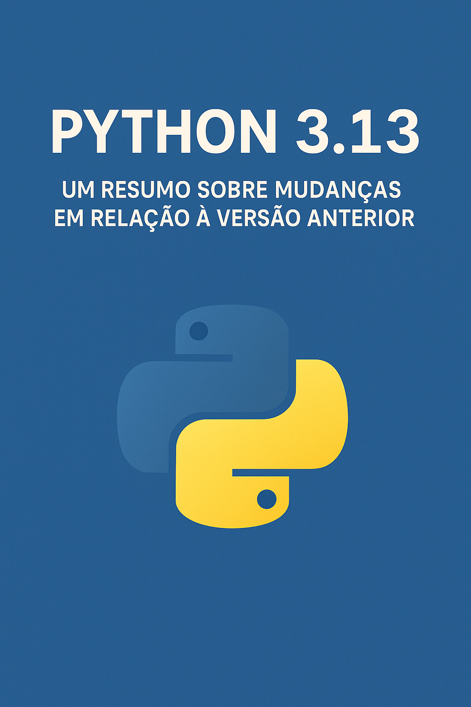

    

-------

# Projeto EBOOK Gerado por I.A. - Título do Ebook/Resumo: "Python 3.13 – Um resumo sobre mudanças em relação à versão anterior"

 > ℹ️ **NOTE:** Este é o repositório desenvolvido durante o curso no qual fui aluno.

Projeto com o objetivo de gerar um ebook digital com as facilidades das ferramentas de IA.

Prompts utilizados seguem abaixo.

<a href=".assets/20250909-Ebook-Python 3-13 – Um resumo sobre mudanças em relação à versão anterior-Criado com IA Generativa.pdf" title="View PDF now"> 📕Clique aqui para ler</a>

## 💻 Tecnologias de IA utilizadas no projeto

- [ChatGPT](https://chat.openai.com/) 
Obs.: Na data de criação deste e-book, o chatGPT já tinha a capacidade de gerar imagens, portanto, a imagem de capa foi possível gerar com ele, sem necessidade de uso de ferramentas adicionais tal como o Midjourney mostrado no curso.

## 🧠 Prompts

ChatGPT：
                                                               |
| :------: | ------------------------------------------------------------------------------------------------------------------------------------------------------------------------------------------------------------------------------------------------------------------------------ |
- Vamos criar um Ebook simples sobre Python. O tema e título é "Python 3.13 - Um resumo sobre Mudanças em Relação a Versão Anterior" Crie uma imagem de capa para esse tema. Em seguida, crie e estrutura os tópicos e conteúdo.
- Crie agora o conteúdo.
- Agora crie apenas os tópicos.

## ✨ Features

- Conteúdo e imagem de capa gerado via ChatGPT

## 📚 Materiais

- Imagem e e-book em `assets`

## 🛠️ Instruções de execução

Utilizei os prompts acima nas ferramentas sugeridas para gerar o material base e editado e convertido para pdf usando ferramentas de edição de texto.

---

⌨️ com 💜 por [Gustavo](https://github.com/GDVP)
